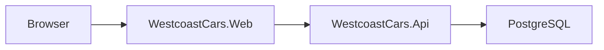

# Westcoast Cars (Modular Monolith)

[](https://github.com/AlejandroA07/car-dealer/actions/workflows/ci.yml)

Westcoast Cars is a .NET 10 sample application for a car dealership platform. It ships as a Docker Compose stack with a Web UI, one merged API, and one PostgreSQL database. Authentication endpoints are hosted inside the main API.

## CI

This repository uses GitHub Actions for formatting, build, test, and Docker image validation:

- Workflow: [`CI`](https://github.com/AlejandroA07/car-dealer/actions/workflows/ci.yml)
- Normal CI intentionally excludes the live Blocket E2E test so PR feedback stays fast and stable

## Architecture

This repository runs as a Docker Compose stack:

- **web** (`WestcoastCars.Web`): ASP.NET Core MVC app (user-facing UI)
- **api** (`WestcoastCars.Api`): REST API for inventory, service bookings, and authentication/authorization
- **db**: PostgreSQL database used by EF Core



The API uses one EF Core context:

- `WestcoastCarsContext`: business tables and ASP.NET Core Identity tables in the default PostgreSQL schema

For sanitized architecture and decision records that are safe to share, see:

- [`public-docs/architecture-overview.md`](public-docs/architecture-overview.md)
- [`public-docs/adr/`](public-docs/adr/)

## Tech stack

- .NET 10 / ASP.NET Core
- PostgreSQL 16
- Docker + Docker Compose

## Quick start (Docker Compose)

### Prerequisites

- Docker Desktop (or Docker Engine + Docker Compose plugin)

### 1) Create a `.env` file (NOT committed)

Create `.env` in the repository root:

- `POSTGRES_PASSWORD` (PostgreSQL password used by the compose DB container)
- `JWT_SECRET` (used by `api` to sign and validate JWTs)
- `ADMIN_PASSWORD` (used by `api` to seed an admin user)

Example:
```bash
POSTGRES_PASSWORD=change-me
JWT_SECRET=change-me-to-a-long-random-value
ADMIN_PASSWORD=change-me
```

### 2) Start the stack

```bash
docker compose up --build
```

### Faster rebuild workflow for development

If you change only one app, rebuild only that service instead of the whole stack:

```bash
docker compose build api
docker compose up -d api
```

```bash
docker compose build web
docker compose up -d web
```

If you want optional runtime memory guardrails while testing locally, include:

```bash
docker compose -f docker-compose.yml -f docker-compose.override.yml -f docker-compose.memory.yml up --build
```

### 3) Open the app

- Web UI: `http://localhost:5002`
- API: `http://localhost:5001`
- Swagger UI (local Development only): `http://localhost:5001/swagger`

## Deployment (Oracle Cloud Always Free VM)

This project is easiest to deploy on a single Linux VM using Docker Compose. The recommended setup exposes only the `web` service publicly over HTTP on port 80.

### 1) Create the VM

- Create an Oracle Cloud “Always Free” Linux VM.
- Open inbound ports:
  - `22/tcp` (SSH) from your IP
  - `80/tcp` (HTTP) from anywhere

### 2) SSH in and install Docker

Example (Ubuntu):
```bash
sudo apt-get update
sudo apt-get install -y git docker.io docker-compose-plugin
sudo usermod -aG docker $USER
exit
```

SSH back in so group permissions apply.

### 3) Clone the repo on the VM

```bash
git clone git@github.com:AlejandroA07/car-dealer.git
cd car-dealer
```

### 4) Create production secrets (never commit)

Create `.env` in the repo root:
```bash
POSTGRES_PASSWORD=change-me
JWT_SECRET=change-me-to-a-long-random-value
ADMIN_PASSWORD=change-me
```

Create `prod_db_password.txt` and set it to the same value as `POSTGRES_PASSWORD`:
```bash
echo "change-me" > prod_db_password.txt
```

Create the shared data-protection key ring directory on the VM:
```bash
mkdir -p dpkeys
```

### 5) Start the stack

```bash
docker compose --env-file .env \
  -f docker-compose.yml \
  -f docker-compose.prod.yml \
  -f docker-compose.deploy.yml \
  up -d --build
```

### 6) Verify

```bash
docker compose ps
docker compose logs -f web
```

Open:
- `http://<YOUR_VM_PUBLIC_IP>/`

### Scaling note: Web Data Protection keys

The default deployment is designed for one `web` container. The `dpkeys` directory stores the ASP.NET Core Data Protection key ring used to protect login cookies:

```yaml
web:
  volumes:
    - ./dpkeys:/app/keys
```

This is safe for a single-container VPS deployment because the same container keeps reading the same key files.

Before running multiple `web` replicas, move the key ring to storage shared by every Web instance. If one instance creates a login cookie and another instance cannot read the same key ring, users can be randomly logged out because the second instance cannot decrypt the cookie.

Good scaling options:

- shared VM/NFS volume mounted at `/app/keys`
- Redis-backed Data Protection key storage
- cloud blob storage such as Azure Blob Storage or S3-compatible storage

## Local development (without Docker)

### Prerequisites

- .NET 10 SDK
- PostgreSQL 16+

### Create database

```sql
CREATE DATABASE westcoast_cars;
```

The API applies migrations on startup. Business tables are created in the default schema and Identity/auth tables are created in the `auth` schema.

### Configure User Secrets

You need one connection string plus a JWT secret and admin seed password.

API:
```bash
dotnet user-secrets init --project WestcoastCars.Api/WestcoastCars.Api.csproj
dotnet user-secrets set "ConnectionStrings:DefaultConnection" "Host=localhost;Port=5432;Database=westcoast_cars;Username=postgres;Password=YourLocalPassword;" --project WestcoastCars.Api/WestcoastCars.Api.csproj
dotnet user-secrets set "JwtSettings:Secret" "<YOUR_GENERATED_SECRET>" --project WestcoastCars.Api/WestcoastCars.Api.csproj
dotnet user-secrets set "AdminSettings:Password" "ChangeThisAdminPassword!" --project WestcoastCars.Api/WestcoastCars.Api.csproj
```

Web:
```bash
dotnet user-secrets init --project WestcoastCars.Web/WestcoastCars.Web.csproj
dotnet user-secrets set "Services:ApiUrl" "http://localhost:5001" --project WestcoastCars.Web/WestcoastCars.Web.csproj
```

### Run services (2 terminals)

```bash
dotnet run --project WestcoastCars.Api/WestcoastCars.Api.csproj
dotnet run --project WestcoastCars.Web/WestcoastCars.Web.csproj
```

### Local API explorer

When the API runs locally in the Development environment, Swagger UI is available at:

- `http://localhost:5001/swagger`

Swagger stays disabled in production by design, so local development is the supported way to inspect and try the API interactively.

### Recommended inner-loop workflow

For the lightest local edit/build/run cycle:

1. Keep only PostgreSQL in Docker:
   ```bash
   docker compose up -d db
   ```
2. Run the applications locally with watch:
   ```bash
   dotnet watch --project WestcoastCars.Api/WestcoastCars.Api.csproj
   ```
   ```bash
   dotnet watch --project WestcoastCars.Web/WestcoastCars.Web.csproj
   ```

Use full Docker rebuilds when you need container/runtime parity, not for every code edit.

## Docker + WSL memory tuning

Machine-specific tuning notes are intentionally kept as local-only documentation and are not part of the shared repository.

## Tests

```bash
dotnet test westcoast-cars.sln
```

### Optional Blocket E2E test

The real Blocket sync E2E test is skipped by default.

Run it when you:
- are preparing a release
- changed Blocket sync logic
- want to verify the live external integration

PowerShell:
```powershell
$env:RUN_BLOCKET_E2E="1"
dotnet test westcoast-cars.sln --filter "Category=ExternalE2E"
```

Regular CI excludes this test on purpose so normal PR feedback stays fast and stable.

## Manual Blocket sync

The API supports a manual Blocket inventory sync through:

```bash
POST /api/v1/vehicles/import/blocket
```

Requirements:
- Authenticated user with `Admin` or `Salesperson` role
- `BlocketApi` settings configured in `WestcoastCars.Api/appsettings*.json`
- `JwtSettings__Secret` configured for the API

Example payload:

```json
{
  "limit": 50,
  "locations": "STOCKHOLM",
  "models": "VOLVO",
  "orgId": "3003419"
}
```

Behavior:
- The sync is manual only
- Each sync replaces the current inventory
- The resulting inventory is capped at 50 latest listings

## Contributing

- Use feature branches.
- Keep secrets out of git (use `.env` for Docker or .NET User Secrets for local runs).
- Prefer small, focused PRs with a clear description and test notes.
