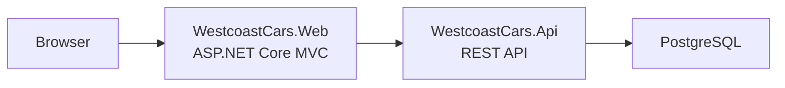

# Westcoast Cars

[](https://github.com/AlejandroA07/car-dealer/actions/workflows/ci.yml)

A car dealership platform built with .NET 10 and Clean Architecture. Manages vehicle inventory, service bookings, and user roles through a REST API and a server-rendered web UI — all running as a Docker Compose stack.

## Tech Stack

- .NET 10 / ASP.NET Core
- PostgreSQL 16
- Entity Framework Core + CQRS (MediatR)
- JWT authentication / ASP.NET Core Identity
- Docker + Docker Compose

## Architecture



## Quick Start

**Prerequisites:** Docker Desktop (or Docker Engine + Compose plugin)

**1. Create a `.env` file in the repo root**

```env
POSTGRES_PASSWORD=your-db-password
JWT_SECRET=your-long-random-secret   # minimum 32 characters
ADMIN_PASSWORD=your-admin-password
```

> **Data protection keys** — both the API and Web containers persist ASP.NET Core Data Protection keys to `./dpkeys/` on the host (mounted at `/app/keys` inside each container). This directory is created automatically on first run. **Back it up.** Losing these keys invalidates all active user sessions and any encrypted payloads. Do not delete it between deployments.

**2. Start the stack**

```bash
docker compose up --build
```

**3. Open**

| Service | URL |
|---------|-----|
| Web UI | http://localhost:5002 |
| API | http://localhost:5001 |
| Swagger (dev only) | http://localhost:5001/swagger |

## Tests

```bash
dotnet test westcoast-cars.sln
```

## Further Reading

- [Architecture overview](public-docs/architecture-overview.md)
- [Architecture decision records](public-docs/adr/)
