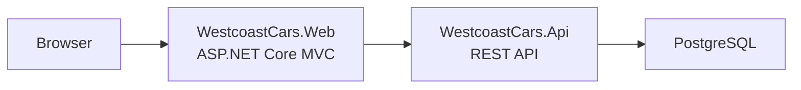

# Westcoast Cars

[](https://github.com/AlejandroA07/car-dealer/actions/workflows/ci.yml)

A car dealership platform built with .NET 10 and Clean Architecture. Manages vehicle inventory, service bookings, and user roles through a REST API and a server-rendered web UI — all running as a Docker Compose stack.

## Tech Stack

- .NET 10 / ASP.NET Core
- PostgreSQL 16
- Entity Framework Core + CQRS (MediatR)
- JWT authentication / ASP.NET Core Identity
- Docker + Docker Compose

## Architecture



---

## Quick Start

Just want to run the app? You only need Docker — no .NET SDK required.

**Prerequisites:** Docker Desktop (or Docker Engine + Compose plugin)

**1. Set up credentials**

```bash
cp env.example .env
```

Open `.env` and fill in your values — Docker Compose injects these into all containers:

| Variable | Description |
|----------|-------------|
| `POSTGRES_PASSWORD` | PostgreSQL password |
| `JWT_SECRET` | JWT signing secret — minimum 32 characters |
| `GUEST_VERIFICATION_SECRET` | Signing secret for guest booking email-verification tokens — minimum 32 characters, keep distinct from `JWT_SECRET` |
| `ADMIN_PASSWORD` | Admin seed account password |
| `EMAIL_SMTP_HOST`, `EMAIL_SMTP_PORT`, `EMAIL_SMTP_USERNAME`, `EMAIL_SMTP_PASSWORD`, `EMAIL_FROM_ADDRESS` | Outgoing SMTP for registration/booking-verification emails — **optional locally**: leave blank and confirmation links/codes are logged to the console instead of emailed; required for any non-Development deployment. Free option: [Brevo](https://brevo.com) (no domain needed); see `env.example` for setup steps |

**2. Start the stack**

```bash
docker compose up --build
```

**3. Open**

| Service | URL |
|---------|-----|
| Web UI | http://localhost:5002 |
| API | http://localhost:5001 |
| Swagger | http://localhost:5001/swagger |
| PostgreSQL | localhost:5432 |

> **Data protection keys** — both containers persist ASP.NET Core Data Protection keys to `./dpkeys/` on the host. Created automatically on first run. **Back it up** — losing these keys invalidates all active sessions. Do not delete between deployments.

> **No email setup needed to try it out** — if you leave the `EMAIL_SMTP_*` variables blank, registration confirmation links and guest-booking verification codes are printed to the API's logs (`docker compose logs api`) instead of emailed. You can type **any** email address (real or made up, e.g. `test@example.com`) when registering or booking as a guest — nothing is actually sent, so there's no need to use a real inbox. Just grab the link/code from the logs to complete the flow.
>
> Prefer not to touch the email flow at all? Log in with one of the seeded accounts below instead (they're pre-confirmed) — logged-in users skip email verification entirely when booking a service.

### Test accounts

These accounts are seeded automatically on first startup, already confirmed. The password for all of them is whatever you set as `ADMIN_PASSWORD` in your `.env`.

| Email | Role |
|-------|------|
| `admin@westcoast-cars.com` | Admin |
| `admin2@westcoast-cars.com` | Admin |
| `salesperson@westcoast-cars.com` | Salesperson |
| `salesperson2@westcoast-cars.com` | Salesperson |
| `user@westcoast-cars.com` | Customer |
| `user2@westcoast-cars.com` | Customer |

The vehicle catalog is also seeded automatically on first startup (~10 vehicles) — no manual "seed" step needed before browsing.

---

## Development

Run the API and Web locally for hot reload and easier debugging.

**Prerequisites:**
- [.NET 10 SDK](https://dotnet.microsoft.com/download)
- Docker Desktop — for the database container (or a local PostgreSQL 16 install)

### 1. Set up credentials

You need credentials in two places: `.env` (used by the DB container) and user secrets (used by the local .NET processes). Both must have the same values.

**a) Create your `.env`**

```bash
cp env.example .env
```

Open `.env` and fill in your values:

| Variable | Description |
|----------|-------------|
| `POSTGRES_PASSWORD` | PostgreSQL password |
| `JWT_SECRET` | JWT signing secret — minimum 32 characters |
| `GUEST_VERIFICATION_SECRET` | Signing secret for guest booking email-verification tokens — minimum 32 characters, keep distinct from `JWT_SECRET` |
| `ADMIN_PASSWORD` | Admin seed account password |
| `EMAIL_SMTP_HOST`, `EMAIL_SMTP_PORT`, `EMAIL_SMTP_USERNAME`, `EMAIL_SMTP_PASSWORD`, `EMAIL_FROM_ADDRESS` | Outgoing SMTP for registration/booking-verification emails — **optional locally**: leave blank and confirmation links/codes are logged to the console instead of emailed; required for any non-Development deployment. Free option: [Brevo](https://brevo.com) (no domain needed); see `env.example` for setup steps |

**b) Set user secrets**

User secrets are stored outside the repo and never committed. Replace each `<...>` with the matching value from your `.env`.

API — from `WestcoastCars.Api/`:

```bash
cd WestcoastCars.Api

dotnet user-secrets set "ConnectionStrings:DefaultConnection" \
  "Host=localhost;Port=5432;Database=westcoast_cars;Username=postgres;Password=<POSTGRES_PASSWORD>"

dotnet user-secrets set "JwtSettings:Secret" "<JWT_SECRET>"

dotnet user-secrets set "GuestVerification:Secret" "<GUEST_VERIFICATION_SECRET>"

dotnet user-secrets set "AdminSettings:Password" "<ADMIN_PASSWORD>"

dotnet user-secrets set "Email:SmtpHost" "<EMAIL_SMTP_HOST>"
dotnet user-secrets set "Email:SmtpPort" "<EMAIL_SMTP_PORT>"
dotnet user-secrets set "Email:Username" "<EMAIL_SMTP_USERNAME>"
dotnet user-secrets set "Email:Password" "<EMAIL_SMTP_PASSWORD>"
dotnet user-secrets set "Email:FromAddress" "<EMAIL_FROM_ADDRESS>"
```

Web — from `WestcoastCars.Web/`:

```bash
cd WestcoastCars.Web

dotnet user-secrets set "JwtSettings:Secret" "<JWT_SECRET>"
```

### 2. Start the database

**Option A — Docker (recommended):**

```bash
docker compose up db
```

Starts PostgreSQL at `localhost:5432` using `POSTGRES_PASSWORD` from your `.env`.

**Option B — native PostgreSQL 16:**

Create a database named `westcoast_cars` with the username and password you used in your user secrets.

### 3. Run the projects

Open two terminals:

```bash
# Terminal 1 — API
cd WestcoastCars.Api
dotnet run --launch-profile http      # http://localhost:5001
dotnet watch --launch-profile http    # same, with hot reload
```

```bash
# Terminal 2 — Web
cd WestcoastCars.Web
dotnet run --launch-profile http      # http://localhost:5002
dotnet watch --launch-profile http    # same, with hot reload
```

| Service | URL |
|---------|-----|
| Web UI | http://localhost:5002 |
| API | http://localhost:5001 |
| Swagger | http://localhost:5001/swagger |
| PostgreSQL | localhost:5432 |

> Migrations run automatically on API startup — no `dotnet ef database update` needed.

---

## Tests

```bash
dotnet test westcoast-cars.sln
```

## Further Reading

- [Architecture overview](public-docs/architecture-overview.md)
- [Architecture decision records](public-docs/adr/)
