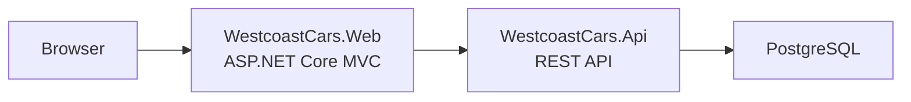

# Architecture Overview

Westcoast Cars is a .NET 10 application built on Clean Architecture and CQRS. It ships as a Docker Compose stack with a server-rendered web UI, a REST API, and a PostgreSQL database.

## System topology



## Layer structure

```
WestcoastCars.Domain          → Entities and business rules. No dependencies.
WestcoastCars.Application     → CQRS commands, queries, validators, interfaces.
WestcoastCars.Infrastructure  → EF Core, repositories, JWT, external API clients.
WestcoastCars.Api             → ASP.NET Core controllers, middleware, Swagger.
WestcoastCars.Web             → MVC frontend that calls the API over HTTP.
WestcoastCars.Contracts       → Shared DTOs between Api and Web.
```

Dependencies only point inward. Domain has no knowledge of EF Core, MediatR, or HTTP.

## Request flow (command example)

```
Controller
  → MediatR pipeline
    → ValidationBehavior (FluentValidation)
    → CommandHandler
      → Repository (via IUnitOfWork)
        → EF Core → PostgreSQL
```

Queries follow the same pipeline without the write path.

## Key patterns

| Pattern | Implementation |
|---------|---------------|
| CQRS | MediatR commands and queries, one handler per use case |
| Repository + Unit of Work | Abstracts EF Core behind interfaces; handlers never touch DbContext directly |
| Domain behavior | Entities own their state transitions — `ServiceBooking.Confirm()`, `Vehicle.MarkAsSold()` with guards |
| Validation pipeline | FluentValidation runs as a MediatR behavior before every command handler |
| Exception translation | Infrastructure translates PostgreSQL constraint violations into domain exceptions |
| JWT authentication | Token generation and validation in Infrastructure; ASP.NET Core Identity for user management |

## Domain model

Core entities: `Vehicle`, `Manufacturer`, `FuelType`, `TransmissionType`, `ServiceBooking`.

`ServiceBooking` enforces a state machine:

```
Pending → Confirmed → Completed
Pending → Cancelled
Confirmed → Cancelled
```

State transitions are guarded on the entity — invalid transitions throw before reaching the database.

## Testing strategy

| Layer | Approach |
|-------|----------|
| Domain | xUnit unit tests — state machine guards, entity behavior |
| Application | xUnit + Moq — handler logic with mocked repositories |
| API | xUnit + Moq — controller routing and response shaping |
| Integration | xUnit + Testcontainers — full request-to-database tests against a real PostgreSQL instance |

## Deliberate constraints

- Swagger is enabled in Development only and not exposed in production.
- Internal working notes and implementation plans are local-only and not part of the shared repository.
