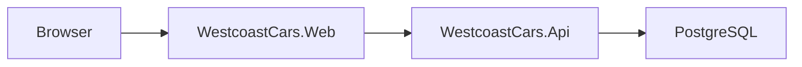

# Architecture Overview

Westcoast Cars is a modular monolith split into a web application, an API, and a PostgreSQL database.

## Current shape

- `WestcoastCars.Web` is the user-facing ASP.NET Core MVC application.
- `WestcoastCars.Api` exposes inventory, service-booking, authentication, and administration endpoints.
- PostgreSQL stores both business data and ASP.NET Core Identity data.
- The API uses one EF Core context: `WestcoastCarsContext`.

## Request flow

1. A browser request reaches `WestcoastCars.Web`.
2. The web app calls `WestcoastCars.Api` over HTTP.
3. The API handles application logic and persists data through EF Core.
4. PostgreSQL stores application state for both inventory and identity.

## Deliberate constraints

- Swagger is intended for local Development use and is not exposed in production.
- Internal working notes and draft plans remain in the local `docs/` folder and are not part of the shared repository.
